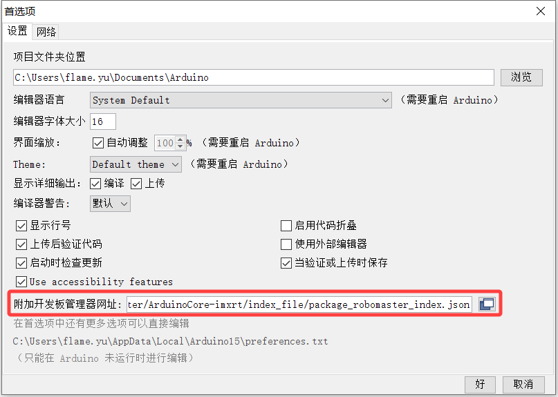
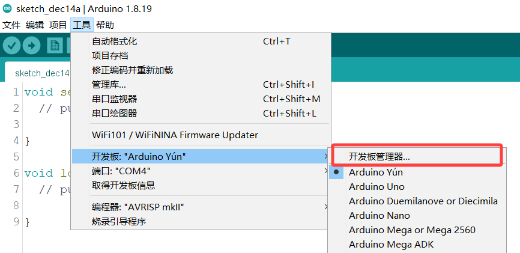

# 1. 开发环境搭建

本指南将引导您在ArduinoIDE中进行RM通用扩展模块的开发。

在此之前，我们需要安装Arduino开发环境。


## 1.1 安装Arduino IDE

如果您有安装过ArduinoIDE，请确认版本不低于1.8.12。

如果还未安装，请先下载并安装[ArduinoIDE](https://www.arduino.cc/en/Main/Software)（[Windows](https://www.arduino.cc/en/Guide/Windows)、[Linux](https://www.arduino.cc/en/Guide/linux)、[Mac](https://www.arduino.cc/en/Guide/MacOSX)）。

安装好Arduino IDE后，我们需要配置开发板环境，以便实现ArduinoIDE对RM扩展模块开发板的支持。

## 1.2 添加开发板

1 启动ArduinoIDE，单击`文件`，然后单击`首选项`（File->Preferences），打开以下页面。



在 `附加开发板管理器网址`（*Additional Boards Managers URLs*）选项框中添加开发板索引：

```
https://raw.githubusercontent.com/RoboMaster/ArduinoCore-imxrt/index_file/package_robomaster_index.json
```

2 回到ArduinoIDE中，单击`工具（tools）`,然后选择`开发板（Board）`>`开发板管理器（Boards Manager）`。



打开开发板管理器后，等待索引更新完成（如失败，请检查您与Github之间的网络是否通畅），向下拉找到`Robomaster Education Boards`栏目，单击`安装（Install）`，等待安装完成，关闭开发板管理器。


再次打开`工具（tools）`->`开发板（Board）`，可以看到刚刚安装好的开发板`RoboMaster Education Boards`，选择所需的开发板，例如`RM Expansion Module(RMEM01)`。


至此，您已成功安装开发板支持包！

## 1.3 创建第一个草图

首先，选中RM扩展模块开发板`RM Expansion Module(RMEM01)`。

在下方的端口（Port）处选择开发板对应的端口。


开发板对应端口可以在计算机管理中看到，其名称应该是如`USB串行设备（COMXX）`类似，括号中的`COM10`即为端口号。


打开Blink示例程序：

点击`文件(File)`->`示例(Examples)`->`01.Basics`->`Blink`，打开新的Blink示例程序。


找到IDE工具栏，从左到右分别是“仅编译”以及“编译+上传”按钮。


点击第二个按钮，ArduinoIDE会在完成编译工作之后自动将编译之后的二进制文件上传（烧写）到RM扩展模块中。

烧写完成后，RM扩展模块的LED灯会以1s的时间间隔间歇闪烁。

