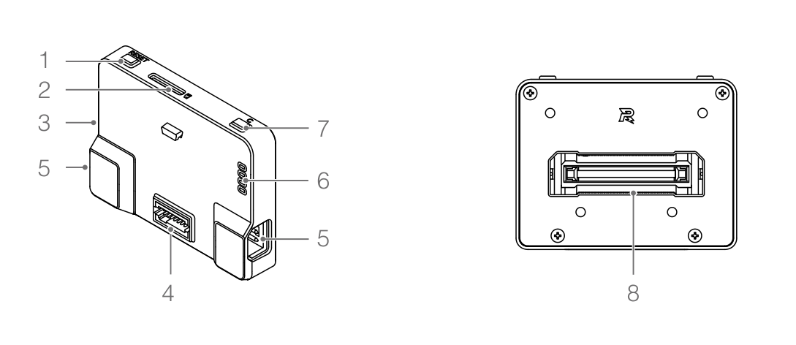
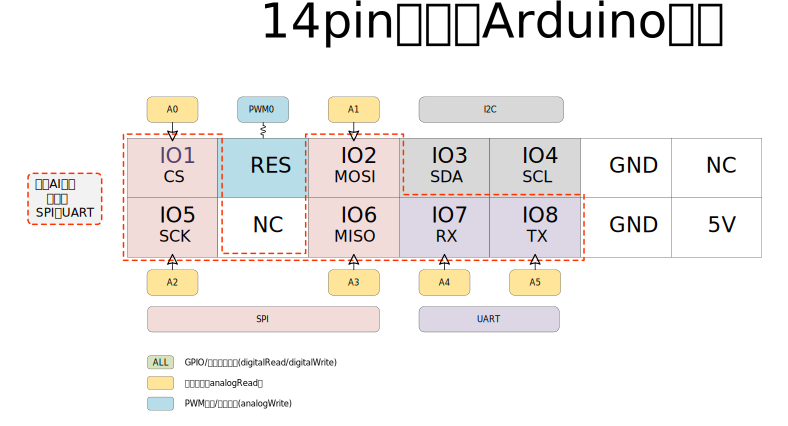
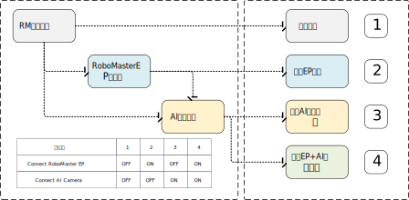
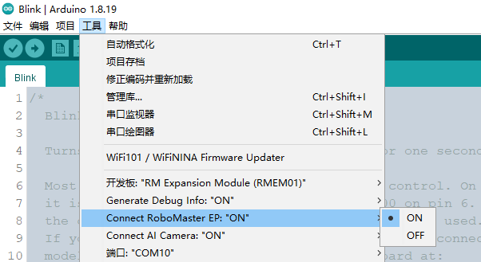

# 2. 认识RoboMaster扩展模块

开发板模块的基本结构如下图所示：



通用扩展模块在作为Arduino开发板使用时，用户可以使用以下资源：

- `3：USB串口`，使用该接口连接到电脑，可作为程序的下载端口，用户调试信息输入输出端口。
- `4:14pin扩展口`，在独立使用模式下，可通过Arduino函数访问该接口中所有的外设资源；连接AI相机后，部分端口用于和AI相机通信，用户任可使用未被占用的引脚。
- `6：LED指示灯`，可自定义控制四个LED灯，显示程序状态。
- `7：自定义按键`，可通过Arduino函数读取电平状态，用于自定义功能。

```{admonition} 小提示
:class: warning
以下接口暂未支持：2：SD卡、5：CAN接口、8：100pin拓展接口
```

详细说明请参考[《机甲大师通用拓展模块用户手册》](https://dl.djicdn.com/downloads/DJI_AI_Module/RM_Expansion_Module_User_Manual_v1.0_cn.pdf)，本文档将重点阐述如何使用Arduino对扩展模块进行开发。

## 2.1 USB串口

USB串口是RM通用扩展模块连接电脑上传（烧录）程序的接口，也可作为普通的串口输入输出信息。

```c++
SerialUSB.begin() //开启USB串口
SerialUSB.read()  //读取USB串口字节
SerialUSB.print() //uUSB串口输出
```
```{admonition} 小提示
:class: tip
与 Arduino Leonardo 类似，RM通用扩展模块中的USB串口为Native USB，在程序上传，复位后会重新枚举。因此，在您烧录程序后，需要重新打开串口，才能正常收发数据。
```

## 2.2 LED指示灯

指示灯可完全由用户控制使用，您可以使用以下接口来控制LED：

- `USER_LED_1`、`USER_LED_2`、`USER_LED_3`、`USER_LED_4`，分别对应开发板上4个LED灯。
- `LED_BUILTIN ` = `USER_LED_1`，为Arduino定义的默认LED灯接口。

操作LED灯的方式与普通IO口一样，如Blink示例代码如下：

```c++
void setup() {
  pinMode(LED_BUILTIN, OUTPUT);
}

void loop() {
  digitalWrite(LED_BUILTIN, HIGH);
  delay(1000);
  digitalWrite(LED_BUILTIN, LOW);
  delay(1000);
}
```

```{admonition} 小提示
:class: tip
在使用RM开发板时，我们提供了一种更加简单的翻转LED的方式：`gpioTogglePin()`，上述示例可改写为：
 ```c++
 void setup() {
 pinMode(LED_BUILTIN, OUTPUT);
 }
 
 void loop() {
 gpioTogglePin(LED_BUILTIN);
 delay(1000);
 }
```

## 2.3 自定义按键

通过 `USER_KEY` 可访问自定义按键接口

## 2.4 14pin扩展接口

14pin扩展接口正面功能定义如下图所示：



该示例图与14pin转接扩展板中的定义一致，在独立使用模式下，上图中所有接口均可通过Arduino函数来调用。引脚描述如下表：

| 引脚名称 | 引脚符号 |        默认外设         |
| :------: | :------: | :---------------------: |
|   IO1    |    CS    |     SPI 片选信号线      |
|   RES    |   RES    | 普通IO口，可用于PWM输出 |
|   IO2    |   MOSI   |       SPI 数据线        |
|   IO3    |   SDA    |       IIC 数据线        |
|   IO4    |   SCL    |       IIC 时钟线        |
|    /     |   GND    |         电源地          |
|    /     |    NC    |       无电气连接        |
|   IO5    |   SCK    |     SPI 时钟信号线      |
|    /     |  NC/GND  |       无电气连接        |
|   IO6    |   MISO   |       SPI 数据线        |
|   IO7    |    RX    |      UART 接收 RX       |
|   IO8    |    TX    |      UART 发送 TX       |
|    /     |   GND    |         电源地          |
|    /     |    5V    |         5V 电源         |

14pin接口中外设的适配情况如下：

### 数字量读写

```c++
pinMode(pin, mode) //配置引脚的模式为输入模式或输出模式
digitalWrite(pin, value) //输出高电平或者是低电平
digitalRead(pin) //读取电平
```

可用引脚：`IO1` / `RES` / `IO2` / `IO3` / `IO4` / `IO5` / `IO6` / `IO7` / `IO8`

### 模拟量读写

```c++
analogRead(pin)  //读入模拟值
analogWrite(pin,value) //通过PWM模拟输出指定电压
```

模拟输入，可用引脚：`IO1` / `IO2` / `IO5` / `IO6` / `IO7` / `IO8`

```{admonition} 小提示
:class: tip
同时，您也可以使用A0-A5来访问这些引脚
```

模拟输出，可用引脚：`RES`

```{admonition} 小提示
:class: tip
或者使用`PWM0`来访问
```

### 串口通信

```c++
Serial.begin(speed) //串口通信初始化
Serial.print(val) //串口输出
Serial.read() //读取串口数据
```

| 引脚名 | IO    |
| ------ | ----- |
| TX     | `IO8` |
| RX     | `IO7` |

### I2C通信

```c++
Wire.begin() //I2C初始化
Wire.beginTransmission(adress) //指定I2C从机地址
Wire.write(val) //指定要发送的数据
Wire.endTransmission() //结束通信并发送数据
```

| 引脚名 | IO    |
| ------ | ----- |
| SCL    | `IO4` |
| SDA    | `IO3` |

### SPI通信

```c++
SPI.begin() //SPI初始化
SPI.transfer(address) //SPI发送数据
```

| 引脚名 | IO    |
| ------ | ----- |
| MOSI   | `IO2` |
| MISO   | `IO6` |
| SCK    | `IO5` |
| CS     | `IO1` |

### Servo舵机控制

```c++
Servo.attach(pin) //舵机引脚初始化
Servo.write(pos) //pos取0-180,对应舵机的角度
```

可用引脚： `RES`

```{admonition} 小提示
:class: tip
或者使用`PWM0`来访问
```


## 2.5 四种工作模式

RM通用拓展模块在使用时有以下四种组合：



RM扩展模块可以完全作为一个独立的Arduino开发板来使用，但涉及到与RoboMaster其他模块连接时，为了开启内置功能，我们在ArduinoIDE的菜单项中设计了两个开关选项：



### 1 独立使用

| 宏                    | 状态 |
| --------------------- | ---- |
| Connect RoboMaster EP | OFF  |
| Connect AI Camera     | OFF  |

该状态下，您可以将RM扩展模块看作一个完全独立的Arduino开发板，可使用Arduino函数控制其提供的所有接口。

### 2 连接AI相机

| 宏                    | 状态 |
| --------------------- | ---- |
| Connect RoboMaster EP | OFF  |
| Connect AI Camera     | ON   |

当您需要连接AI相机，做一些人工智能的扩展应用时，请使用该模式，打开该开关是使用内置库`RMAI_Results`的必要条件。

```{admonition} 注意
:class: warning
此时，14pin扩展接口中，SPI 和 UART 将被占用。
```

### 3 连接EP

| 宏                    | 状态 |
| --------------------- | ---- |
| Connect RoboMaster EP | ON   |
| Connect AI Camera     | OFF  |

使用扩展模块连接EP机器人时，需要打开该开关。

```{admonition} 注意
:class: warning
此时，USBSerial调试串口、CAN 将被占用
```

### 4 同时连接EP和AI相机

| 宏                    | 状态 |
| --------------------- | ---- |
| Connect RoboMaster EP | ON   |
| Connect AI Camera     | ON   |

将AI模块通过RM扩展模块接入EP机器人请使用该模式，此时RM扩展模块将作为AI模块和EP机器人之间沟通的桥梁，同时其他未被占用的接口您任然可以正常使用。

```{admonition} 注意
:class: warning
此时，USBSerial调试串口、CAN、14pin扩展接口中的 SPI 和 UART 将被占用。
```

每种组合详细介绍与资源占用情况如下：

| 序号 | 模式           | 说明                                                         | 资源占用情况                                             |
| :--- | :------------- | :----------------------------------------------------------- | :------------------------------------------------------- |
| 1    | 单独使用       | 单独使用模式下，该模块可被认为是一个通用Arduino开发板，所有的引脚均向用户开放，使用ArduinoIDE可使用开发板全部资源。 | 所有资源全部可用                                         |
| 2    | 配合EP使用     | 该模式用于给EP机器人扩展传感器，通过我们提供的RMEP库，用户可以与EP通信，控制机器人的移动等，同时利用开发板丰富的资源和扩展接口，控制自定义传感器、执行器，极大扩展EP的功能和可玩性。 | USBSerial调试串口、CAN接口                               |
| 3    | 配合AI相机使用 | 该模式下，用户可使用AI相机提供的物体识别功能，通过我们提供的RMAI库，用户可以在Arduino中轻松获取到识别物体的名称、位置、数量，可行度等等关键信息，结合自行接入的执行器（如舵机），完成如垃圾识别分类，自动分拣等人工智能应用。（注意：该模式会占用14pin接口） | 14pin接口中SPI接口和UART接口                             |
| 4    | 配合EP+AI相机  | 此时模块作为中间设备，为EP机器人和AI模块做沟通的桥梁，同时用户也可以自定义传感器、执行器接入EP，拓展功能。 | USBSerial调试串口、CAN接口和14pin接口中SPI接口和UART接口 |

不同模式资源可用情况如下表：

| 序号 | 模式 |  USB调试串口   |      USB摄像头       |   UART3（14PIN）   |   SPI3（14PIN）    |    CAN接口     |
| :-----------: | :-----------: | :------------: | :------------------: | :----------------: | :----------------: | :------------: |
|   1     |   单独使用   |      可用      | 不可用(无AI相机输入) |        可用        |        可用        |      可用      |
|   2     |   连接EP   | 不可用(接入EP) |    不可用(接入EP)    |        可用        |        可用        | 不可用(接入EP) |
|   3     | 连接AI相机 |      可用      |         可用         | 不可用(AI相机占用) | 不可用(AI相机占用) |      可用      |
|   4     | 连接EP+AI相机  | 不可用(接入EP) |    不可用(接入EP)    | 不可用(AI相机占用) | 不可用(AI相机占用) | 不可用(接入EP) |

内置库说明：

| 名称         | 可用模式 | 功能                                           |
| ------------ | -------- | ---------------------------------------------- |
| RMAI_Results | 模式3    | 获取AI相机识别到的物体数量、大小、位置等信息。 |
