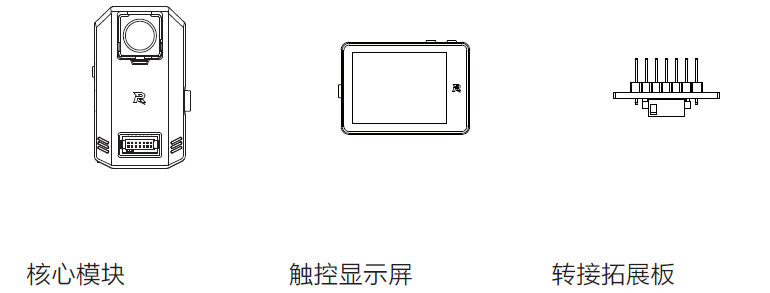

# 3. 开发板使用示例

本章将通过几个示例，带您快速上手RM扩展模块的开发。

## 3.1 获取AI模块识别结果

使用 AI 训练平台训练并完成部署一个模型到 AI 模块中后，AI 模块即可离线运行神经网络算法，并实时输出目标检测的结果，以使机器人拥有“机器视觉”，利用这些信息完成丰富多彩的人工智能应用。



连接电脑，将训练好的模型下载到核心模块后，将其接入扩展模块。


在RM扩展模块Arduino源代码中，我们已经内置了一套高效的通信框架，并通过`RMAI_Results`库的形式提供用户接口，让您能够轻松的与AI模块通信、获取AI模块识别结果；同时，通信库是完全开源的，如果需要更高级的功能，您也可以参考 Open_Protocol 协议自定义添加其他指令。

```{admonition} 小提示
:class: tip
如您需要使用自己的Arduino开发板与AI模块通信，请见官网手册《AI 模块与第三方开发板通信开发指南》。
```

在使用`RMAI_Results`库之前，请确保:

1. 选中RM扩展模块开发板。
2. 在Arduino中打开`Connect AI Camera`开关。
3. 将AI核心模块插入到14pin接口中。

接着直接打开`示例`->`RMAI_Results`->`ReadResults`。


源码如下(ReadResults.ino)：

```c++
#include <Arduino.h>
#include <RMAI_Results.h>

RMAI_Results ai_results;

void setup()
{
    pinMode(LED_BUILTIN, OUTPUT);
    SerialUSB.begin(SERIAL_8N1);
    ai_results.begin();
    ai_results.setCallback(ai_objects_callback);
}

void loop()
{
    ai_results.run();
    gpioTogglePin(LED_BUILTIN);
    delay(50);
}

void ai_objects_callback(results_tag *results, uint8_t result_num)
{
    for (uint8_t i = 0; i < result_num; i++)
    {
        SerialUSB.print("ID: ");
        SerialUSB.println(results[i].id);
        SerialUSB.print("    x: ");
        SerialUSB.println(results[i].x);
        SerialUSB.print("    y: ");
        SerialUSB.println(results[i].y);
        SerialUSB.print("    w: ");
        SerialUSB.println(results[i].w);
        SerialUSB.print("    h: ");
        SerialUSB.println(results[i].h);
        SerialUSB.print("    C: ");
        SerialUSB.println(results[i].c);
    }
}
```

### 代码详解

事实上，该库依赖底层Open_Protocol线程，因此需要开启`Connect AI Camera`开关。如果您需要自定义其他功能，可修改其底层实现部分（详见task_protocol.c）。

1. 首先，引入头文件，实例化RMAI_Results类。

```c++
#include <RMAI_Results.h>
RMAI_Results ai_results;
```

2. setup() 中，执行初始化函数，注册回调函数。

```c++
ai_results.begin();
ai_results.setCallback(ai_objects_callback);
```

3. loop() 中，执行run() 函数，该函数会调用用户自定义的回调函数。

```c++
ai_results.run();
```

4. 回调函数，当收到AI模块发送过来的识别结果时，run()会调用该函数，用户可在该函数中执行自定义程序。

```c++
void ai_objects_callback(results_tag *results, uint8_t result_num)
{
    for (uint8_t i = 0; i < result_num; i++)
    {
        SerialUSB.print("ID: ");
        SerialUSB.println(results[i].id);
        SerialUSB.print("    x: ");
        SerialUSB.println(results[i].x);
        SerialUSB.print("    y: ");
        SerialUSB.println(results[i].y);
        SerialUSB.print("    w: ");
        SerialUSB.println(results[i].w);
        SerialUSB.print("    h: ");
        SerialUSB.println(results[i].h);
        SerialUSB.print("    C: ");
        SerialUSB.println(results[i].c);
    }
}
```

```{admonition} 小提示
:class: tip
回调函数的函数名可以自定义，但参数类型请保持与示例相同。
```

在头文件`RMAI_Results.h`中可以看到`results_tag`的定义，每个tag包含了一个物体的识别信息。

```c++
typedef struct tag {
    uint8_t id;
    uint16_t x;
    uint8_t y;
    uint16_t w;
    uint8_t h;
    uint8_t c;
} results_tag;
```

### 识别结果

打开`ArduinoIDE`->`工具`->`串口监视器`。


AI模块通过串口输出的识别结果帧格式为：

| ID   | 中心坐标 X | 中心坐标 Y | 宽 W | 高 H | 置信度 |
| ---- | ---------- | ---------- | ---- | ---- | ------ |

各个字段的含义如下：

1. `ID` : 目标 N 的 ID 表示 AI 模块运行的用户模型中，检测目标的 ID，例如 ID=0 表示该目标为“苹果”。此 ID 在用户使用大疆教育 AI 训练平台训练自己的模型时被创建。此外，目标0~目标 N（N<20）根据中心坐标从左到右、从上到下排列。假如画面中有 4 个目标，其中心坐标分布如下图，则输出的识别结果中，首先是目标 0 的信息，之后依次是 1、2、3。
    
2. `X、Y` : X、Y 分别为目标识别框中心点的坐标。如上图，以画面左上角为坐标原点。坐标 X 的范围为(0-319)，坐标 Y 的范围为(0-239)，单位均为像素。
3. `W、H` : 如上图，宽 W、高 H 分别表示目标识别框的宽、高，单位均为像素。
4. `C` : 置信度表征推理出的目标为真的概率，范围为(0-100)。

上述示例的运行结果如图：


## 3.2 OLED自定义显示


U8g2库是一种通用的嵌入式图形库，支持绝大多数单色OLED和LCD显示器，如常用的SSD1306\SH1107等。
具体使用方法和更多支持型号详见：

- [https://github.com/olikraus/u8g2/wiki](https://github.com/olikraus/u8g2/wiki)

在RM扩展模块核心项目中，我们将U8g2进行了适配，此外针对cortex-m7架构进行了预编译，这将节省您每次几分钟的编译时间。但请注意，如果您已经安装了U8g2库，可能会与核心自带的库冲突。
```{admonition} 小提示
:class: tip
目前仅支持I2C接口（SPI接口暂不支持）
```

您可以使用市面上常见的OLED模块，如0.96寸的OLED 12864（I2c）。

默认情况下，U8g2库使用Arduino中的Wire接口（对应RM扩展模块开发板中的14pin端子I2C接口），按照：
`5V-5V`，`GND-GND`，`SCL-SCL`，`SDA-SDA`的引脚对应关系接入。

使用如下测试代码：
```c++
#include <Arduino.h>
#include <U8g2lib.h>
#include <Wire.h>

U8G2_SSD1306_128X64_NONAME_F_HW_I2C u8g2(U8G2_R0, /* reset=*/ U8X8_PIN_NONE);

void setup(void) {
  u8g2.begin();
  pinMode(LED_BUILTIN, OUTPUT);
}

void loop(void) {
  u8g2.clearBuffer();
  u8g2.setFont(u8g2_font_ncenB08_tr);
  u8g2.drawStr(0,10,"Hello RoboMaster!");
  u8g2.sendBuffer();
  delay(1000);
  gpioTogglePin(LED_BUILTIN);
}
```
接线方法及结果如图所示：


如正常驱动，屏幕上会显示 Hello RoboMaster! 字样。

此外，在`文件`->`示例`->`RM Expansion Module(RMEM01)的例子`->`U8g2`中还有更多官方自带的例程。

## 3.3 驱动PWM舵机

核心库中，针对imxrt架构适配了Servo舵机驱动库，因此您可以直接使用Servo库来驱动普通PWM舵机。

RM扩展开发板的PWM接口：

- 14pin扩展接口 `RES(PWM0)`
- 100pin扩展接口 （保留）

将任意PWM舵机的信号线（一般是黄色，边缘）接入到14pin扩展接口中的`RES(PWM0)`引脚，将5V、GND连接供电。

以最常用的SG90微型舵机为例。

使用如下示例，或者从`示例`->`RM_Examples`->`HelloServo`打开

```c++
#include <Arduino.h>
#include <Servo.h>

Servo sg90;

int pos = 0;
void setup()
{
    sg90.attach(PWM0);
    pinMode(LED_BUILTIN, OUTPUT);
}

void loop()
{
    for (pos = 0; pos <= 180; pos += 1)
    {
        sg90.write(pos);
        delay(5);
    }
    gpioTogglePin(LED_BUILTIN);
	
	for (pos = 180; pos >= 0; pos -= 1)
    {
        sg90.write(pos);
        delay(5);
    }
    gpioTogglePin(LED_BUILTIN);
}
```

下载程序后，舵机应从0-180度来回旋转运动，同时LED灯在最大、最小角度点时改变状态。
