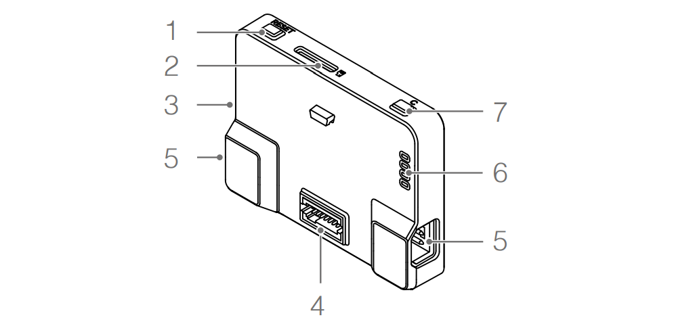
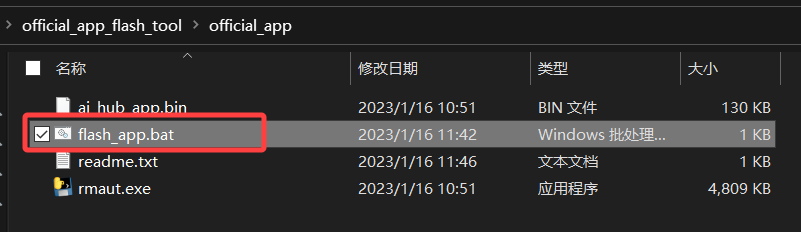
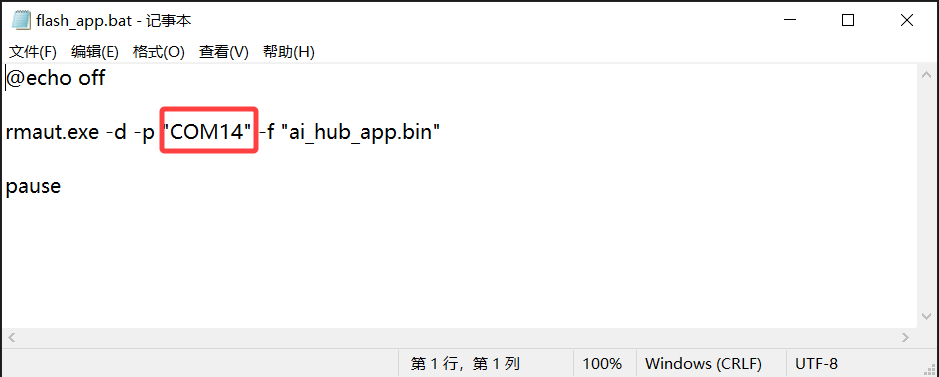
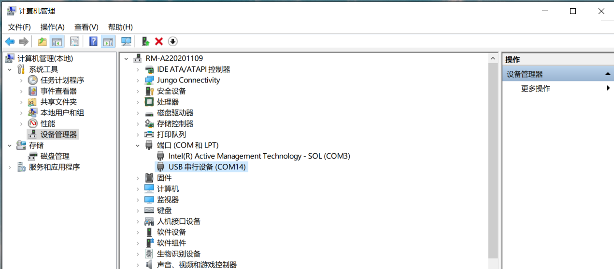
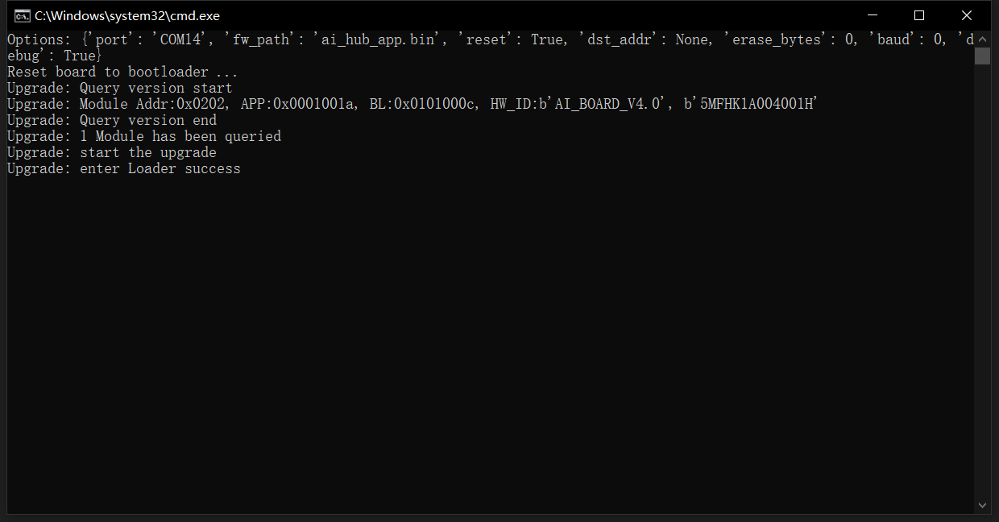

# 5. 常见问题


## 5.1 如何进入Bootloader



如图所示，开发板的上方有两个按键  

`按键1` -> 复位按键，短按可将通用拓展模块复位  
`按键7` -> 自定义功能按键

进入bootloader的方式：

- 在断电的情况下，按住`按键7`->上电->再松开`按键7`

- 在上电的情况下，按住`按键7`->单击`按键1`->再松开`按键7`

## 5.2 如何烧写官方固件

工具下载页面：
[https://github.com/RoboMaster/ArduinoCore-imxrt/releases/tag/v1.0.1](https://github.com/RoboMaster/ArduinoCore-imxrt/releases/tag/v1.0.1)

打开页面，单击`Assets`中的`official_app_flash_tool.zip`下载，完成后解压，打开文件夹



找到名为`flash_app.bat`的脚本文件，右键->`编辑`，打开脚本文件    



找到第二行中的`COM口`参数，修改为实际的`COM口`

```{admonition} 小提示
:class: tip
如何查看开发板的COM口  
`桌面`->`右键`，`此电脑`->`管理`打开计算机管理  
`设备管理器`->`端口`，查看设备当前的COM口  

```

回到文件夹，双击`flash_app.bat`，出现如下界面，等待烧写完成即可。



```{admonition} 小提示
:class: warning
如果开发板程序处于卡死状态，未出现COM口，请参考5.1中的手动进入Bootloader，再执行烧写操作
```

## 5.3 COM口未出现

> 在使用Arduino编写程序的时候，我们经常会遇到因为错误造成单片机无法正常工作的问题，
> 此时程序不工作后，电脑上不会出现COM口，无法通过正常的方式下载程序。

解决方式：手动进入Bootloader即可，参考`5.1`中的手动进入bootloader的方法