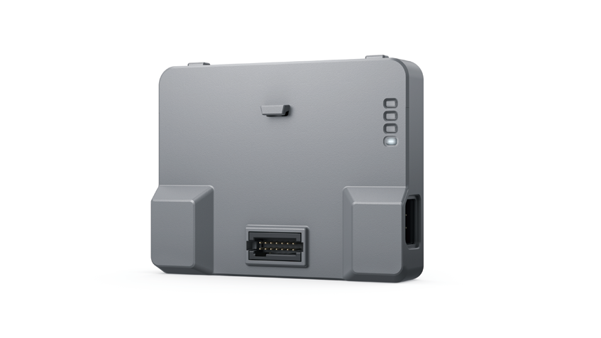

# 1. 开发板简介

## 1.1 简介

机甲大师通用拓展模块可配合 AI 人工智能教育套件安装在RoboMaster EP 上使用。用户可借助大疆教育平台的 Rogram 编程平台进行 Block 编程，或借助 Python SDK 进行代码编程，以使 RoboMaster EP 实现丰富多彩的人工智能应用。

通用拓展模块也可以单独作为开源主控使用（Arduino），可通过 14 Pin 扩展口接入第三方传感器到RoboMaster EP 平台，以实现更多编程控制应用。

## 1.2 开发板资料

### 手册

- [用户手册](https://dl.djicdn.com/downloads/DJI_AI_Module/RM_Expansion_Module_Quick_Start_Guide.pdf)

- [快速入门指南](https://dl.djicdn.com/downloads/DJI_AI_Module/RM_Expansion_Module_User_Manual_v1.0_cn.pdf)

### 官方资料站

- [资料下载页面](https://www.dji.com/cn/ai-module/downloads)

